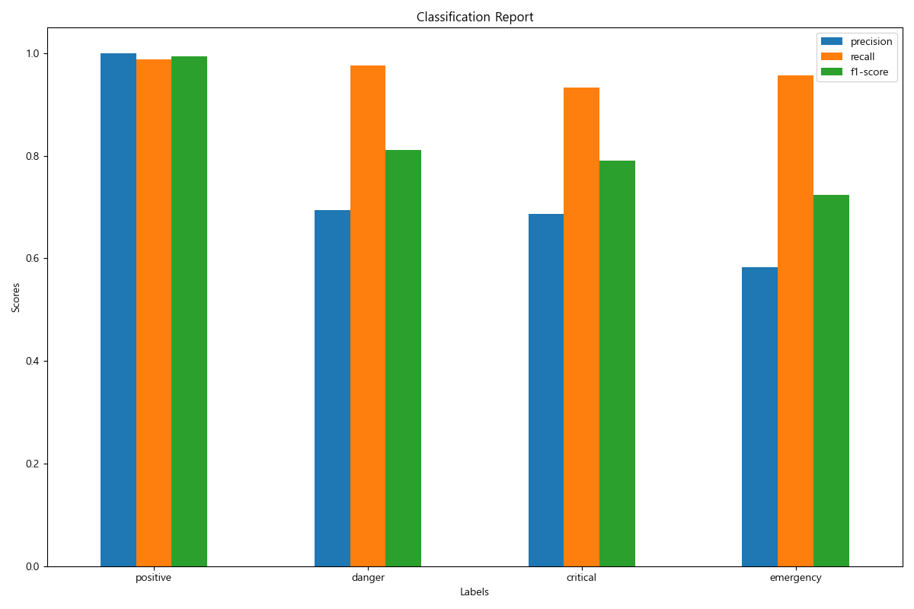
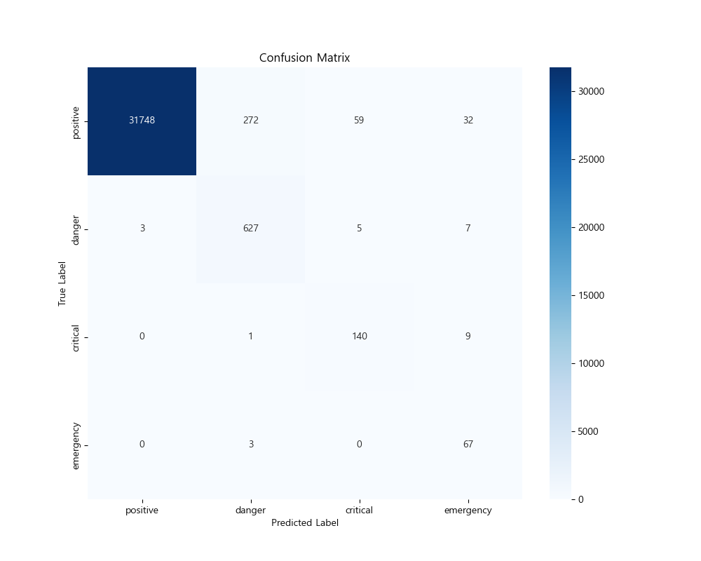
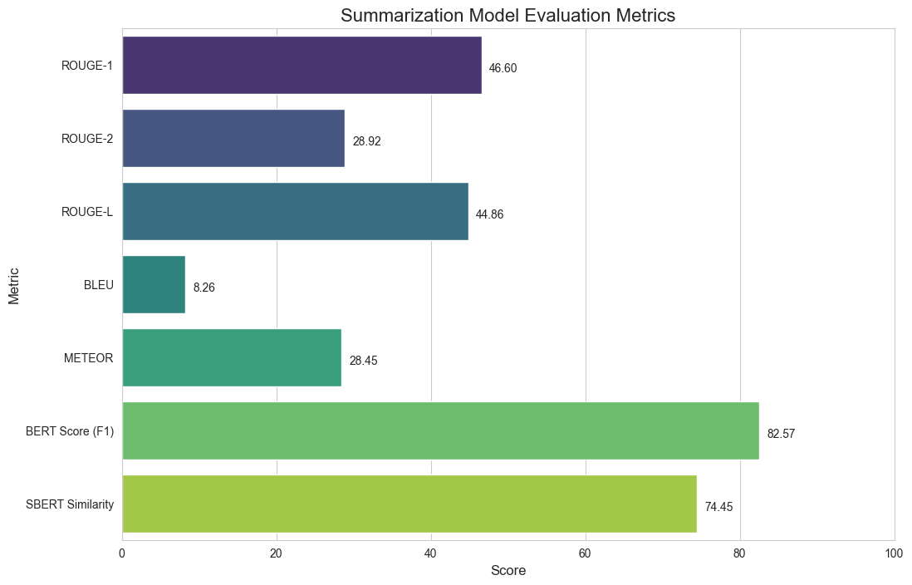

# 시니어 발화 데이터 분석을 통한 위험도 분류 및 대화 요약 모델

본 프로젝트는 KISTI DATA/AI 경진대회 참가를 기본 목적으로 합니다.

-   [KISTI 2025 DATA/AI 경진대회 - 고독사 예방을 위한 시니어케어 돌봄로봇(돌봄인형) 데이터 분석](https://aida.kisti.re.kr/competition/main/problem/PROB_000000000002824/detail.do)

시니어 이용자와 AI 돌봄 인형과의 대화 데이터를 기반으로 사용자의 위험도를 분류하고, 대화 내용을 요약하는 두 가지 AI 모델을 제공합니다.

-   **위험도 분류**
    -   대화의 문맥, 감정, 시간적 특성을 종합적으로 분석하여 사용자의 위험도를 다음 4단계로 분류합니다.
        -   `positive`, `danger`, `critical`, `emergency`
-   **대화 요약**
    -   긴 대화 세션의 핵심 내용을 간결하게 요약하여 제공합니다.

## 목차

-   [프로젝트 구조](#프로젝트-구조)
-   [설치 및 준비](#설치-및-준비)
-   [실행](#실행)
-   [모델 설명](#모델-설명)
-   [참고 자료](#참고-자료)
-   [라이선스](#라이선스)

## 프로젝트 구조

```
.
├── data/                  # 모델의 학습, 전처리, 테스트 데이터
├── demo/                  # 테스트 실행 데모 영상
├── figures/               # 모델의 설명, 실험 결과 설명에 사용된 그림 및 결과 파일
├── model/                 # 학습된 모델 파일
├── scripts/               # 스크립트 파일 (미사용)
├── notebooks/             # 노트북 파일 (.ipynb)
├── src/                   # 파이선 파일 (.py)
│   ├── predict.py         # 예측 코드
│   ├── label/
│   │   ├── preprocess.py  # 위험도 분류 모델 전처리 코드
│   │   ├── train.py       # 위험도 분류 모델 학습 코드
│   │   ├── evaluation.py  # 위험도 분류 모델 평가 코드
│   │   └── run.py         # 위험도 분류 모델 실행 코드
│   └── summary/
│       ├── preprocess.py  # 요약 모델 전처리 코드
│       ├── train.py       # 요약 모델 학습 코드
│       ├── evaluation.py  # 요약 모델 평가 코드
│       └── run.py         # 요약 모델 모델 실행 코드
├── requirements.txt
└── README.md
```

> 데이터 파일은 경진대회 규정에 따라 외부 공개 및 공유할 수 없으며 저장소에 포함되지 않습니다.

## 설치 및 준비

### 요구사항

`requirements.txt` 참고

#### 파이선 버전 및 주요 의존성

-   Python == 3.13
-   PyTorch == 2.8
-   Pandas == 2.3.3
-   Scikit-learn == 1.7.2
-   Transformers == 4.57.0
-   Sentence-transformers == 5.1.1
-   Konlpy (Okt) == 0.6.0
    -   Java(JDK) 실행 환경 필요

##### 개발 환경

기본 개발 환경은 다음과 같습니다.

-   Driver Version: 581.42
-   CUDA Version: 13.0

### 설치

저장소를 클론하고 필요한 라이브러리를 설치합니다.

```bash
git clone https://github.com/odigano/pkdt-ai_carebot_risk_detection_data_kisti.git
cd pkdt-ai_carebot_risk_detection_data_kisti
pip install -r requirements.txt
```

#### 모델 준비

다음 압축된 모델 파일을 `model/label`, `model/summary` 디렉터리에 각각 압축 해제해주세요.

##### 위험도 분류 모델

-   [label_model](https://drive.google.com/file/d/1k-kUJ2VDCJYR5nvihfhwjfgZa2arTCZy/view?usp=sharing)

##### 요약 모델

-   [summary_model](https://drive.google.com/file/d/1LTsyHJ29-r0CF1P1_uCNYK9MIXjvVcnE/view?usp=sharing)

## 실행

### 예측

```bash
cd src
python predict.py

# --input_csv 인자를 사용하여 불러올 CSV 파일을 지정할 수 있습니다.
# 생략할 경우 기본 경로는 ../data/prediction/dialogue.csv 사용합니다.
python predict.py --input_csv ../dialogue_test.csv
```

불러올 CSV 파일 형태는 다음과 같아야 합니다.

| doll_id | text         | uttered_at          |
|---------|--------------|---------------------|
| 1       | 오늘 너무 덥네 | 2025-09-22 10:20:30 |
| 1       | 지금 몇 시야   | 2025-09-22 10:20:40 |

### 단계별 실행

위험도 분류 모델 및 대화 요약 모델 소스 코드는 유사한 형태로 실행 가능합니다.

세부 파라미터 및 실행 결과는 다르니 해당 소스 코드 또는 --help 옵션을 참고해주세요.

```bash
cd src/label # 또는 cd src/summary
```

#### 전처리

```bash
python preprocess.py
```

#### 학습

```bash
python train.py
```

#### 평가

```bash
python evaluation.py
```

### 전체 파이프라인 실행

```bash
python run.py all
```

## 모델 설명

본 프로젝트의 모델 출력을 기반으로 별도의 [FastAPI 프로젝트](https://github.com/odigano/pkdt-ai_carebot_risk_detection_python) 서버를 통해 아래 예시와 같은 응답을 서비스로 제공합니다.

```json
{
    "overall_result": {
        "doll_id": "1",
        "dialogue_count": 3,
        "char_length": 32,
        "label": "positive",
        "confidence_scores": {
            "positive": "0.9897",
            "danger": "0.0079",
            "critical": "0.0008",
            "emergency": "0.0017"
        },
        "treatment_plan": "특별한 위험 징후는 없습니다. 지속적으로 모니터링해 주세요.",
        "full_text": "오늘 너무 덥네 지금 몇 시야 조금 있다가 밥 먹어야 겠다",
        "reason": {
            "evidence": [
                {
                    "seq": 1,
                    "text": "지금 몇 시야",
                    "score": "0.9937"
                },
                {
                    "seq": 2,
                    "text": "조금 있다가 밥 먹어야 겠다",
                    "score": "0.9937"
                }
            ],
            "summary": "오늘 너무 덥다고 말하며 밥을 먹어야겠다고 함"
        }
    },
    "dialogue_result": [
        {
            "seq": 0,
            "doll_id": "1",
            "text": "오늘 너무 덥네",
            "uttered_at": "2025-09-22T10:20:30",
            "label": "positive",
            "confidence_scores": {
                "positive": "0.9897",
                "danger": "0.0079",
                "critical": "0.0008",
                "emergency": "0.0017"
            }
        },
        {
            "seq": 1,
            "doll_id": "1",
            "text": "지금 몇 시야",
            "uttered_at": "2025-09-22T10:20:40",
            "label": "positive",
            "confidence_scores": {
                "positive": "0.9937",
                "danger": "0.0030",
                "critical": "0.0012",
                "emergency": "0.0021"
            }
        },
        {
            "seq": 2,
            "doll_id": "1",
            "text": "조금 있다가 밥 먹어야 겠다",
            "uttered_at": "2025-09-22T10:20:50",
            "label": "positive",
            "confidence_scores": {
                "positive": "0.9937",
                "danger": "0.0034",
                "critical": "0.0014",
                "emergency": "0.0014"
            }
        }
    ]
}
```

### 위험도 분류 모델

사용자 발화의 위험도를 positive, danger, critical, emergency 4단계로 분류하는 모델입니다.

단일 발화보다 가능한 대화의 문맥을 종합적으로 이해하여 위험 상황을 탐지하는 것을 목표로 합니다.

#### 주요 특징

##### 학습 데이터

-   전체 발화 수
    -   102,973건
-   위험도 별 발화 개수 및 비중:
    -   positive: 42,111건 (40.90%)
    -   danger: 15,642건 (15.19%)
    -   critical: 20,150건 (19.57%)
    -   emergency: 25,070건 (24.35%)

자체적으로 위험도 분류 수기 라벨링 작업이 완료된 KISTI DATA/AI 경진대회 제공 데이터를 사용하였습니다. (총 발화 32,973건)

부족한 데이터 및 클래스 불균형 이슈를 해결하기 위해 LLM을 이용해 데이터를 증강하였습니다. (70,000건)

##### 하이브리드 모델 아키텍처

-   **Transformer Encoder**: 사전 학습된 **klue/roberta-base** 한국어 모델을 이용해 입력된 대화 문맥의 깊은 언어적 의미를 파악합니다.
-   **Bi-LSTM (양방향 LSTM)**: Transformer가 추출한 텍스트 임베딩의 순차적 흐름을 학습합니다.
-   **Multi-head Attention**: LSTM이 처리한 시퀀스에서 위험도 판단에 중요한 부분에 더 높은 가중치를 부여하여 핵심 정보를 강조합니다.
-   **분류기 (Classifier)**: 위에서 추출된 모든 특성(텍스트, 시간, 감정, 문맥 위험도)을 결합하여 최종적으로 위험도를 분류합니다.

##### 처리 방식 - 다중 특성 활용

텍스트, 시간, 감정, 그리고 이들을 종합한 문맥 위험도까지 다각적으로 분석하여, 단편적인 발화가 아닌 대화의 전체적인 흐름 속에서 사용자의 상태를 깊이 있게 파악하는 것이 이 모델의 핵심 전략입니다.

1. 텍스트 특징 (Textual Features)

- 대화의 가장 기본적인 정보인 텍스트는 대화의 흐름을 파악할 수 있도록 가공됩니다.

    - 전처리 단계: 현재 발화를 포함하여 일정 시간 이내의 대화들을 하나의 긴 문맥으로 묶습니다. 이렇게 합쳐진 텍스트는 한국어에 특화된 언어 모델이 이해할 수 있는 숫자 시퀀스로 변환됩니다.

    - 학습 단계: 모델은 먼저 이 숫자 시퀀스로부터 각 단어와 문장의 깊은 의미를 추출합니다. 그다음, 대화의 순서와 흐름에 담긴 정보를 학습하여, 단어의 의미뿐만 아니라 대화가 어떤 순서로 진행되었는지를 종합적으로 이해합니다.

2. 시간 특징 (Temporal Features)

- '언제' 대화했는지는 사용자의 상태를 파악하는 중요한 단서입니다. 모델은 두 가지 시간 정보를 활용합니다.

    - 이전 발화와의 시간 간격:

        - 전처리 단계: 현재 발화와 바로 이전 발화 사이의 시간 차이를 초 단위로 계산합니다.
        - 학습 단계: 이 시간 차이는 과거에 발생한 위험 발화의 영향력을 계산할 때 시간에 따른 감쇠 인자(Decay Factor)로 사용됩니다. 이를 통해 모델은 오래된 위험 신호보다 최근에 발생한 위험 신호에 더 큰 가중치를 부여하게 됩니다.

    - 발화 시각:

        - 전처리 단계: 대화가 발생한 시각(0~23시)을 추출합니다.
        - 학습 단계: 23시와 0시가 가깝다는 시간의 순환적 특성을 이해시킵니다. 종합적으로 모델은 특정 시간대에 반복되는 사용자의 위험 패턴을 학습할 수 있습니다.

3. 감정 특징 (Emotional Features)

- 텍스트에 직접적으로 드러나는 감정이나 위험 징후를 명시적인 숫자로 변환하여 모델에 전달합니다.

    - 전처리 단계: '도와줘', '아파', '외로워' 등 위험도와 관련된 키워드 사전을 미리 구축합니다. 각 발화에서 이 키워드들이 얼마나 자주 등장하는지, 그리고 각 키워드의 위험 가중치가 얼마나 되는지를 바탕으로 '감정 점수'를 계산합니다.

    - 학습 단계: 이 감정 점수는 다른 특징들과 함께 모델의 입력으로 직접 사용됩니다. 이를 통해 모델은 특정 위험 키워드의 등장을 놓치지 않고 명확한 위험 신호로 받아들일 수 있습니다.

4. 문맥 위험도 특징 (Contextual Risk Feature)

- 과거 대화의 위험도가 현재에 미치는 누적된 영향을 수치화합니다.

    - 전처리 단계: 현재 발화 시점까지의 과거 대화 내용, 각 발화의 위험도, 그리고 발화 사이의 시간 간격 정보들을 순서대로 저장해 둡니다.

    - 학습 단계: 저장된 과거 대화 기록을 바탕으로 '문맥 위험도'라는 새로운 특징을 실시간으로 계산합니다.

        - 과거 발화들의 위험도를 점수로 변환합니다.
        - 이 점수에 시간 감쇠(Time Decay)를 적용합니다. 즉, 지수 함수를 이용해 해당 발화가 얼마나 오래전에 발생했는지에 따라 영향력을 감소시킵니다.
        - 이렇게 시간에 따라 가중치가 부여된 점수들을 모두 합산하여 최종 '문맥 위험도' 점수를 만듭니다. 이 점수는 모델의 최종 판단 직전에 '위험도 편향(Risk Bias)'으로 작용합니다. 즉, "최근에 위험한 대화가 많이 쌓였다면, 현재 발화의 위험도를 더 높게 예측하라"는 강력한 지침을 모델에 전달하는 역할을 합니다.

##### 클래스 불균형 해소

-   Focal Loss를 손실 함수로 사용하여, 데이터 수가 적은 critical, emergency와 같은 소수 클래스의 학습 가중치를 높였습니다.
-   또한, 클래스별 데이터 수의 역빈도와 위험도 수준에 따른 수동 가중치를 조합하여 손실 함수에 적용함으로써, 모델이 높은 위험도 클래스를 탐지하는 데 더 집중하도록 유도했습니다.

#### 평가

##### Confusion Matrix Score

| Label            | Precision | Recall | F1-Score | Support |
| ---------------- | --------- | ------ | -------- | ------- |
| Positive         |    0.9999 | 0.9887 |   0.9943 |   32111 |
| Danger           |    0.6944 | 0.9766 |   0.8117 |     642 |
| Critical         |    0.6863 | 0.9333 |   0.7910 |     150 |
| Emergency        |    0.5826 | 0.9571 |   0.7243 |      70 |
|                  |           |        |          |         |
| **Accuracy**     |           |        |   0.9881 |   32973 |
| **Macro Avg**    |    0.7408 | 0.9640 |   0.8303 |   32973 |
| **Weighted Avg** |    0.9916 | 0.9881 |   0.9892 |   32973 |



##### Confusion Matrix Heatmap



### 요약 모델

긴 대화 세션의 내용을 압축하여 핵심을 파악할 수 있는 간결한 요약문을 생성하는 모델입니다.

한국어에 특화된 T5 모델을 파인튜닝하여 사용합니다.

#### 주요 특징

##### 학습 데이터

-   전체 요약 데이터 수
    -   7,700건

KISTI DATA/AI 경진대회 제공 데이터에 대해 인형 별 발화 간격이 10분 이내인 경우를 하나의 대화 세션으로 상정하였습니다. (총 발화 32,973건)

하나의 대화 세션 내용을 LLM을 통해 요약 라벨링 데이터를 생성하였습니다.

##### T5 기반의 Seq2Seq 모델

-   사전 학습된 **paust/pko-t5-small** 한국어 T5 모델을 기반으로 합니다.
-   추출 요약이 아닌 추상 요약을 목표로 합니다.

#### 평가



-   **ROUGE-1**: 생성된 요약과 정답 요약 간에 겹치는 단어(unigram)의 비율을 측정합니다.
-   **ROUGE-2**: 생성된 요약과 정답 요약 간에 겹치는 연속된 두 단어(bigram)의 비율을 측정합니다.
-   **ROUGE-L**: 생성된 요약과 정답 요약 간의 최장 공통 부분 서열(LCS)을 기반으로 문장 구조의 유사성을 측정합니다.
-   **BLEU**: 생성된 문장이 정답 문장과 얼마나 유사한지를 n-gram의 정밀도(precision)를 통해 측정합니다.
-   **METEOR**: 단어의 동의어, 형태소 등을 고려하여 정밀도와 재현율의 조화 평균으로 문장 유사도를 측정합니다.
-   **BERT Score (F1)**: BERT 임베딩을 사용하여 생성된 문장과 정답 문장 간의 의미적 유사도를 F1 점수로 평가합니다.
-   **SBERT Similarity**: 문장 전체를 벡터로 임베딩하여 문장 간의 코사인 유사도로 의미적 유사성을 측정합니다.

성능 평가 지표에서 ROUGE 등 형태론적 접근 지표는 떨어지지만 BERTScore 등 의미론적 접근 지표에서는 비교적 높은 성능을 보여줍니다.

## 참고 자료

-   [Hugging Face - klue/roberta-base](https://huggingface.co/klue/roberta-base)
-   [Hugging Face - paust/pko-t5-small](https://huggingface.co/paust/pko-t5-small)

## 라이선스

MIT 라이선스를 따릅니다.
